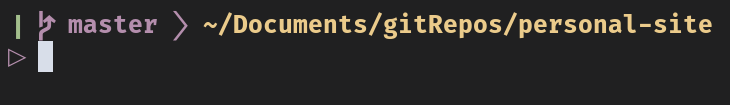

------------
I've been using Linux for a long time; I always used the default prompt because I figured it was the default for a reason, so it was best to leave it like that.

It was until not long ago that I decided to customize my prompt to this:



To my surprise changing the prompt is not complicated at all, only a matter of changing the value of a variable: The **PS1** variable.

Before we continue, this is not precisely a tutorial on how to change your prompt it is an example of how I customized mine.

I will show you the process that I followed; if you want to learn how to add more elements to the one you make, I recommend reading two posts, the [first](https://misc.flogisoft.com/bash/tip_colors_and_formatting) to check how the colours work and the [second](https://www.cyberciti.biz/tips/howto-linux-unix-bash-shell-setup-prompt.html) to learn about different components you can add.

Another thing to note is that I will be using [Alacritty](https://github.com/alacritty/alacritty) as my terminal, [Nord](https://www.nordtheme.com) with a different colour for the background as the theme and [Fira Code](https://github.com/tonsky/FiraCode) as the font.

With that aside, let's begin.

The first thing I did is think about what I wanted to include, which were three main sections:
1. If I was in a git repo, I wanted to be able to see the current branch.
2. The directory I was currently working on.
3. That the commands I type appear in a new line.
Let's start with the first point.
I needed a way to check if the current directory is a git repository; the command I found is:
``` bash
git -C . rev-parse 2>/dev/null
```
*2>/dev/null* is there so that the command output doesn't print to the terminal.

By default, the exit status of the previous command execution is in the variable $?, which is 0 if there are no errors; this means that if the value of the variable $? after the above command equals 0, then the current directory is a git repository.

That gave me a solution to the first problem; now I needed a way to get thecurrent git branch name; this is also a single command:

``` bash
$(git symbolic-ref --short HEAD)
```

The enclosure in $() is to run it and print the output inside the echo double-quotes.

With those two commands, I wrote the following function:

``` bash
git_branch() {
	git -C . rev-parse 2>/dev/null
	if [[ "$?" -eq 0 ]]; then
		echo " $(git symbolic-ref --short HEAD)  "
	fi
}
```

It should be pretty self-explanatory about how it works, but if you have problems,here are the steps it follows:
1. It checks if we are in a git repo with the command we learned.
2. It compares the value of $? to 0 to check for errors in the previous\n    execution.
3. If there were no errors, it prints the current branch name.

**NOTE:** The characters "" and "" don't look like that in the final prompt; they will look similar to the image if you use the Fira Code font.

I stored the call to the function inside a variable:

``` bash
GIT_BRANCH="\$(git_branch)"
```

It is similar to calling it inside echo; the backslash calls the function every time we use the variable.

The previous will work, but it will have the default colour; I changed that next.

The basic format for adding colour to the terminal is:

``` bash
"\[\033[STYLE;FOREGROUND;BACKGROUNDm\]"
```

I want the git section to be bold and purple; to make it easier to understand and edit in the future, I used a variable for the foreground colour, so in the end, it will look like this:

``` bash
GIT_FG=35
GIT_BRANCH="\[\033[1;${GIT_FG}m\]\$(git_branch)"
```

That solves the first and most complicated part of the custom prompt; the next two, showing the current working directory and having the commands in a new line, are as simple as the following:

``` bash
DIR_FG=36
CURRENT_DIR="\[\033[1;${DIR_FG}m\]\w\n"
```

It has three parts:

1. The colour this time is yellow.
2. \w: this shows the current working directory.
3. \n: this is just a newline.

One final thing is to make clearer that the commands will appear in a new line; I did this by adding an arrow character.

``` bash
PROMPT_FG=35
PROMPT="\[\033[${PROMPT_FG}m\]▷\[\033[0;39;49m\] "
```

It also sets the prompt character to purple and everything after that to the default colour.

The final step was to put everything together and export it.

``` bash
PS1="${GIT_BRANCH}${CURRENT_DIR}${PROMPT}"
export PS1
```

The final script looks something like this:

``` bash
#!/bin/bash

GIT_FG=35
DIR_FG=33
PROMPT_FG=35

git_branch() {
	git -C . rev-parse 2>/dev/null
	if [[ "$?" -eq 0 ]]; then
		echo " $(git symbolic-ref --short HEAD)  "
	fi
}

GIT_BRANCH="\[\033[1;${GIT_FG}m\]\$(git_branch)"
CURRENT_DIR="\[\033[1;${DIR_FG}m\]\w\n"
PROMPT="\[\033[${PROMPT_FG}m\]▷\[\033[0;39;49m\] "

PS1="${GIT_BRANCH}${CURRENT_DIR}${PROMPT}"
export PS1
```

I saved the script and added the following to my .bashrc and .bash_profile.

``` bash
if [ -f ~/custom_prompt.sh ]; then
	. ~/custom_prompt.sh
fi
```

Finally, I sourced .bashrc and .bash_profile to apply the new prompt.

**BONUS:** you can add this line to your script to show a status indicator in your prompt; it will turn green if the previous command exited without errors and red if the opposite.

``` bash
CHECK="\$([[ \$? == 0 ]] && echo -e \[\033[32m\]❙ || echo -e \[\033[31m\]❙) "
```

Remember to add the CHECK variable at the start of your PS1 variable.

``` bash
PS1="${CHECK}${GIT_BRANCH}${CURRENT_DIR}${PROMPT}"
```

As you can see, customizing the prompt is very simple; you can do many things to make it look just the way you like; it is just a matter of doing some research and trial and error.

Thank you for reading this post.
